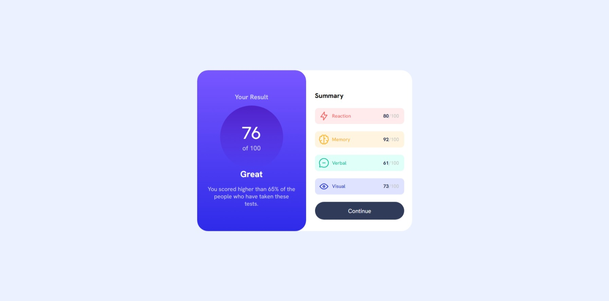

# Frontend Mentor - Results summary component solution

## Table of contents

- [Overview](#overview)
  - [Screenshot](#screenshot)
  - [Links](#links)
- [My process](#my-process)
  - [Built with](#built-with)
  - [What I learned](#what-i-learned)
  - [Continued development](#continued-development)
  - [Useful resources](#useful-resources)
  - [AI Collaboration](#ai-collaboration)
- [Author](#author)

**Note: Delete this note and update the table of contents based on what sections you keep.**

## Overview

### Screenshot



### Links

- Solution URL: [Frontend Mentor Solution](https://your-solution-url.com)
- Live Site URL: [Deployed Solution](https://osmond20.github.io/Results-Summary-Component/)

## My process

### Built with

- Semantic HTML5 markup
- CSS custom properties
- Flexbox
- CSS Grid
- Mobile-first workflow
- SASS

### What I learned

I learned how to use flexbox and CSS grid more appropriately and this challenge really got me to think about use case of CSS grid in my summary card and also using flexbox for optimal responsive design. I learned that with mobile-first, it is not necessary to add a fixed height of 100vh as the height flows naturally as the div containers fill up the viewport because they are stacking up vertically. I also learned how to use gradients which I found to be cool to learn in this challenge.
code snippets,see below:

- letting the layout flow naturally for a mobile-first design
```css
body, main{
    display: flex;
    align-items: center;
    justify-content: center;
    margin: 0;
    width: 100%;
    padding: 0;
}

```
- gradients applied in the css
```css
background-image: linear-gradient(to bottom, var(--light-slate-blue-background), var(--light-royal-blue-background) );
```

- using grid to stack metrics appropriately
```css
.summary_card{
    height: 100%;
    width: 17.2rem;
    display: grid;
    grid-template-rows: repeat(6, 4.1rem);
}
```

### Continued development

Will be learning javascript to ensure that I can load the JSON data dynamically into this project, which would be useful for my learning curve. And also maintaining my understanding and knowledge gained thus far with flexbox and grid in responsive design.

### Useful resources

- [Resource 1](https://cssgradient.io/) - Helped with figuring out how to make the gradient seen in the solution

### AI Collaboration

Describe how you used AI tools (if any) during this project. This helps demonstrate your ability to work effectively with AI assistants.

- What tools did you use (e.g., ChatGPT, Claude, GitHub Copilot)? GitHub CoPilot
- How did you use them (e.g., debugging, generating boilerplate, brainstorming solutions)? Used it for debugging and providing hints for me whenever I got stuck and felt I was not getting things right. And it worked best for me when it provided the hints because it got me to see where I was going wrong and what's the direction that I can take to ensure that I do get it right.

## Author

- Website - [Github](https://github.com/osmond20)
- Frontend Mentor - [@osmond20](https://www.frontendmentor.io/profile/osmond20)


